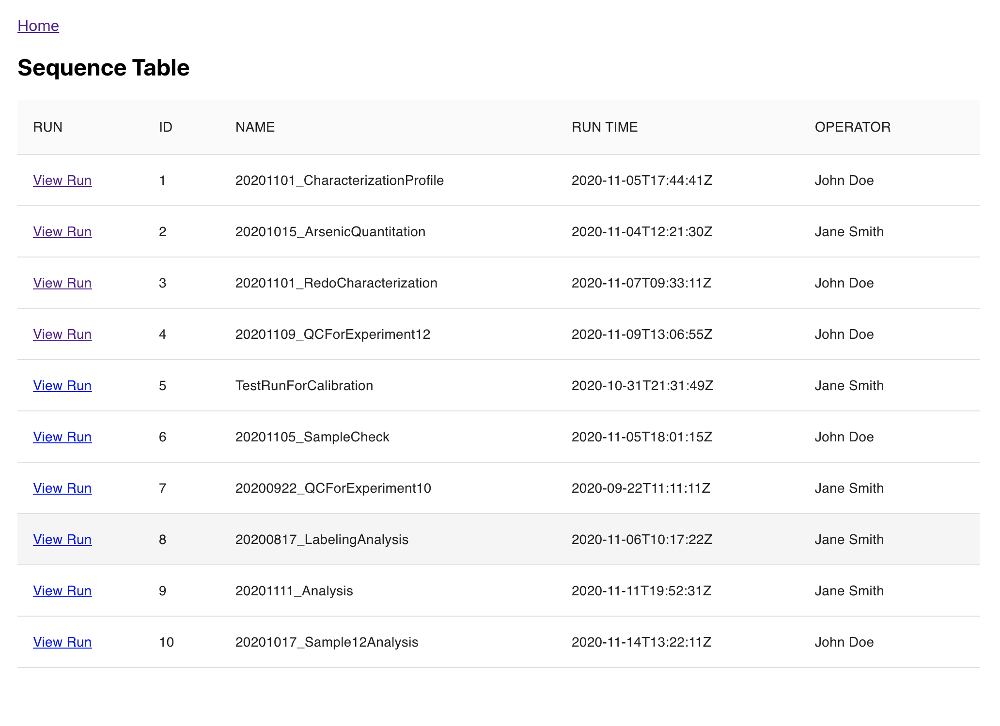
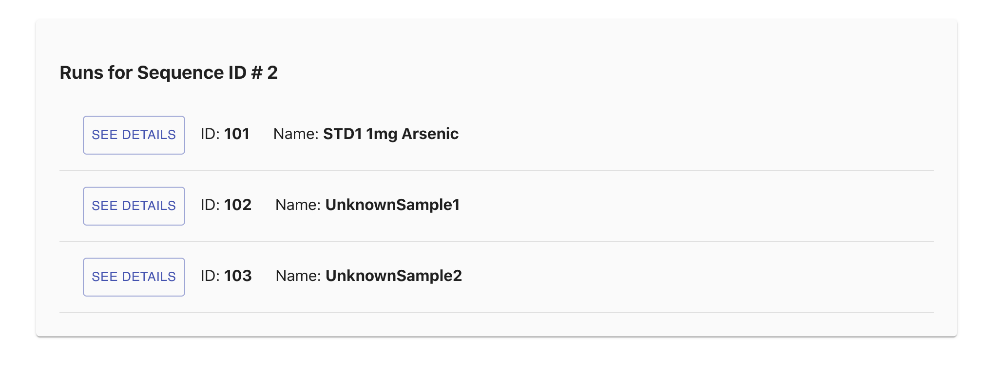
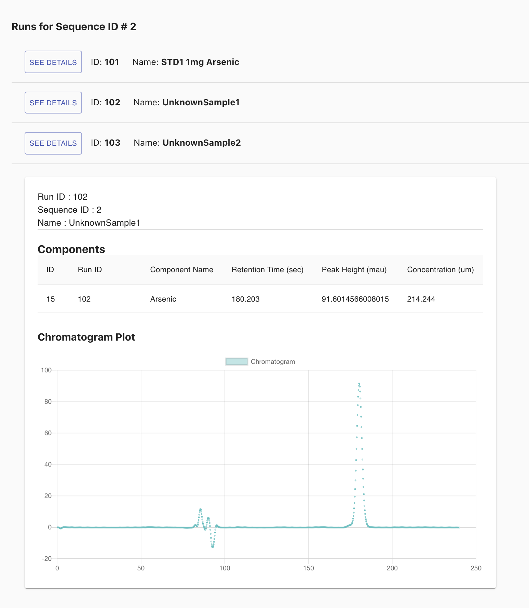

# Installation
```shell
# install dependencies
npm install

# start the application
npm start

# run test (I've only add a few lines of test, I still need to lear how to test react)
npm test
```


# Take-Home Test Task 1 Instructions

### Using the “API Specification” below, develop an interface that fulfills the following requirements:
1. A user should be able to view all sequences and their identifying details (name, run time, operator)
2. A user should be able to view details of all the runs within a single sequence
3. A user should be able to view the chromatogram of any single run as a plot

### Optional (not listed in order of priority, select any that sound interesting if time allows):
- A user should be able to easily compare component concentrations across
different runs within the same sequence
- When rendering a chromatogram for a run, mark and label the peaks so that a
user can identify the isolated compound and its relevant information (retention
time, peak height)
- Write unit tests


### Some guidelines for this assignment:
- The exact flow/layout of the pages is up to you, so try your best to build an
intuitive interface that would make sense to someone familiar with HPLC. We know you will have to make assumptions here because you haven’t had a chance to talk to users, so don’t spend too much time trying to figure out what the most intuitive interface would be. We just expect a reasonable prototype that you could take to a user for feedback.
- This is a time-bound exercise, so focus on developing a fully functional prototype over all else.
  - It’s okay to make suboptimal decisions in your code or approach, just be sure to document these with a TODO and an explanation of what you might do differently with more time.
  -You won’t be judged on the aesthetics of your final product, so don’t spend a lot of time on visual tweaks.
- Feel free to use any Javascript-based approach when creating this interface.
- We will view your final product in the latest version of Google Chrome.

# Task 1 Screenshots
### List of all sequences
#### Click `View Run` to see all runs in a sequence


### All Runs within a single sequence
#### Click `SEE DETAILS` to view detail of a run.



### Run Details
#### Run Details shows list of components and the chromatogram plot.


# Task 2
1. Give a summary of the technologies:
 - React - I used react for many reasons. First, UI can be broken down into smaller and reusable components which makes it easy to build complex UI. React is also performant because of its own virtual DOM where it runs a diffing algorithm to reload only what has changed.
 - Material-UI - I used this to save time on styling components.
 - Axios - it has an easy to use API for handling any HTTP communication. For example, it automatically transforms the data to json format while for fetch(), you have to manually do it yourself. Axios also provides errors, while fetch does not.
 - react-chart-js-2 - easy to use library for charting. If I have more time, I would explore other charting libraries such as D3.
 - React-router-dom - Used for routing of two components (Sequence, Runs).
 - ESLint, Prettier, Airbnb linter - These are all for development dependencies only to help me with formatting and make sure my code follows best practices.

2. Provide a brief explanation about the organization of the interface as it relates to usability.
   - On page load, the Sequence component is loaded. Each item in the sequence has a link to view  the list of runs for that sequence item.
   - On the runs page, you will see a run or list of runs. You'll see a button "SEE DETAILS" on the left to view the details. The detail page has all the run info, components and also the Chromatogram plot.


3. If you could change anything about the APIs described in the specification, what would it be?
 If I could change something in the API, that is separating the Chromatogram data from the list of runs data. I would like to separate the Chromatogram so that I only load that data when I am viewing a single Run. Let say you have a 20 runs on one sequence, that means you also need to load lots of data upfront. With how I built the app, I only need the Chromatogram when viewing one run.

4. Was there anything you would have added to your solution if you had more time? If so, please describe them in order of priority.

- #1. Improving the Chromatography graph. I need to explore other charting libraries. On chartjs, I can’t find examples or documentation for setting x-axis and y-axis labels. Add any data point on the graph. Ask the data engineer if my graph is correct and make modification as needed.

- #2. Add the feature where components of each Run can be compared side by side.

- #3. Add a test. All of the testing I have done in the past was all for the backend. I attempted to add a test for this assignment. However, I need to learn more about testing react, such as testing after the component is mounted (useEffect loads the data).

- #4. Refactor the Runs component. I need to review this part. I had trouble loading the chromatogram data, so I added additional state that I think is redundant. I also want to refactor how I break down the UI for this component.
